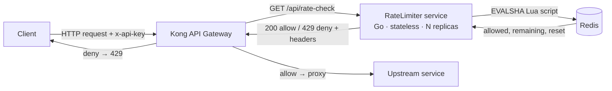

# RateLimiter — Redis-backed token bucket rate limiter for Go and Kong

A small, stateless HTTP service that answers one question for your API gateway: **should this request be allowed or rate-limited?** It enforces a per-client [token bucket](https://en.wikipedia.org/wiki/Token_bucket) atomically in Redis using a Lua script, so you can run many copies behind a load balancer and they all share one consistent limit.

Built to sit in front of [Kong](https://konghq.com/), but it works with any gateway or service that can make an HTTP call before proxying a request.


> Replace `github.com/your-org/RateLimiter` throughout with your real repository path.

---

## Why

A correct distributed rate limiter has two hard parts: the counting has to be **atomic** across every instance hitting Redis, and the service has to **stay cheap and predictable** because it sits in the synchronous path of every request. This project keeps the read-modify-write inside a single Redis Lua script (one round trip, no races), keeps the Go service stateless, and uses Redis's own clock so replicas never disagree on time.

## Features

- **Atomic token bucket in Redis** — refill, check, and decrement run as one Lua `EVALSHA`. No check-then-act race, no over-admission under concurrency.
- **Single clock source** — the script reads `redis.call('TIME')`, so replicas don't drift apart on NTP skew.
- **Stateless and horizontally scalable** — no per-client state in process memory; add instances freely, Redis holds the state.
- **Standard rate-limit headers** — `X-RateLimit-Limit`, `X-RateLimit-Remaining`, `X-RateLimit-Reset`, and `Retry-After` on denials.
- **Configurable fail mode** — choose `closed` (deny when Redis is unreachable) or `open` (allow). Defaults to `closed`.
- **Self-cleaning keys** — every bucket gets a TTL sized to its refill time, so idle clients expire on their own. No background GC.
- **Liveness and readiness probes** — `/healthz` and `/readyz` for Docker and orchestrators.
- **Env-driven config with fail-fast validation** — bad values stop the process at boot instead of misbehaving at request time.

## Architecture



The service holds no client state in memory, so any replica can serve any request. Redis is the single source of truth and the scaling limit; run it in HA (Sentinel or Cluster) behind one endpoint when you need it.

## How the token bucket works

Each client identity maps to a Redis hash `{ tokens, ts_ms }` under the key `<prefix>:tb:<identity>`. On every request the Lua script:

1. Reads the current time from Redis (`TIME`), in milliseconds.
2. Loads the bucket, treating a missing key as a full bucket (new clients can burst up to capacity).
3. Refills: `tokens = min(capacity, tokens + elapsed_seconds * refill_rate)`.
4. If at least one token is available, removes one and allows the request; otherwise denies.
5. Writes the new token count and timestamp back, and sets a TTL equal to the time it would take to refill to full.

Because steps 1–5 execute inside one server-side script, Redis runs them serially per key. Concurrent requests can never both read the same "last token" and both succeed.

## Quick start

### Prerequisites

- Go 1.26+
- A Redis 7 instance (the included Compose file provides one)
- Optional: Docker + Kong, if you want the full gateway setup

### Run it locally

```bash
# 1. Clone
git clone https://github.com/your-org/RateLimiter.git
cd RateLimiter

# 2. Start Redis (or point REDIS_ADDR at your own)
docker compose up -d redis

# 3. Configure (optional — sensible defaults are built in)
cp .env.example .env        # then export the vars, or set them inline below

# 4. Run the service
RL_BUCKET_CAPACITY=100 RL_REFILL_RATE=10 go run ./cmd
```

The service listens on `:8080` by default.

### Try a request

```bash
# Allowed requests return 200 with rate-limit headers
curl -i -H "x-api-key: demo" http://localhost:8080/api/rate-check
```

```http
HTTP/1.1 200 OK
X-Ratelimit-Limit: 100
X-Ratelimit-Remaining: 99
X-Ratelimit-Reset: 0
```

Once a client exhausts its tokens, it gets a `429`:

```http
HTTP/1.1 429 Too Many Requests
Retry-After: 1
X-Ratelimit-Limit: 100
X-Ratelimit-Remaining: 0
X-Ratelimit-Reset: 10
```

## Configuration

All configuration comes from environment variables and is validated at startup. Unknown schemes, invalid fail modes, and non-positive limits stop the process with a clear error.

| Variable | Default | Description |
|---|---|---|
| `RL_PORT` | `8080` | HTTP listen port |
| `REDIS_ADDR` | `localhost:6379` | Redis `host:port` |
| `REDIS_PASSWORD` | _(empty)_ | Redis password, if any |
| `REDIS_DB` | `0` | Redis database index |
| `REDIS_POOL_SIZE` | `50` | Connection pool size |
| `REDIS_DIAL_TIMEOUT_MS` | `200` | Dial timeout (ms) |
| `REDIS_READ_TIMEOUT_MS` | `100` | Per-command read timeout (ms) |
| `RL_SCHEME` | `token_bucket` | Algorithm. Only `token_bucket` is implemented today |
| `RL_BUCKET_CAPACITY` | `100` | Burst ceiling (max tokens) |
| `RL_REFILL_RATE` | `10` | Tokens added per second |
| `RL_FAIL_MODE` | `closed` | `open` (allow) or `closed` (deny) when Redis fails |
| `RL_KEY_PREFIX` | `rl` | Namespace for all Redis keys |

See [`.env.example`](.env.example) for a copy-paste starting point.

## API

### `GET /api/rate-check`

The hot path. Your gateway calls this before proxying.

**Request header:** `x-api-key` identifies the client. A missing key falls back to a shared `anon` bucket, so unauthenticated traffic is still limited rather than bypassing the limiter.

**Responses:**

| Status | Meaning | Headers |
|---|---|---|
| `200` | Allowed | `X-RateLimit-Limit`, `X-RateLimit-Remaining`, `X-RateLimit-Reset` |
| `429` | Denied | the above, plus `Retry-After` (seconds) |

When Redis is unreachable and the fail mode is `closed`, the service returns `429` with `Retry-After: 1` and no rate-limit headers. With fail mode `open`, it returns `200`.

### `GET /healthz`

Liveness. Always returns `200` while the process is up.

### `GET /readyz`

Readiness. Pings Redis and returns `200` if reachable, `503` otherwise. Useful for gating traffic at the orchestrator level, independent of the request-time fail mode.

## Fail mode

Redis is a single point of failure on the request path, so the behavior when it is down is a deliberate choice:

- **`closed`** (default): deny on Redis error. Protects the upstream at the cost of availability.
- **`open`**: allow on Redis error. Favors availability over enforcement.

Note that this interacts with the gateway. The included `kong.yml` fails **open** when the rate-check service itself is unreachable. So with the service set to fail closed: a total service outage lets traffic through, while a Redis-only outage denies it. Pick the combination that matches your upstream's tolerance.

## Kong integration

[`kong/kong.yml`](kong/kong.yml) is a DB-less declarative config. A `pre-function` plugin calls `GET /api/rate-check` before proxying: on `429` it short-circuits the request, on a connection error it fails open. Bring up the gateway with:

```bash
docker compose up -d kong redis
```

Kong proxies on `:8000`; its admin API and manager UI are on `:8001` and `:8002`.

## Testing

```bash
# Unit tests run anywhere; integration tests need a Redis on localhost:6379
docker compose up -d redis
go test -race ./...
```

The rate-limiter integration tests exercise real Redis behavior (burst, refill, and a concurrent no-over-admission check under the race detector). They skip cleanly if no Redis is reachable, so the suite stays green offline.

## Project layout

```
.
├── cmd/main.go                       # HTTP server: routes, wiring, health/readiness
├── internal/
│   ├── config/                       # env config + boot validation
│   ├── redisx/                       # Redis client builder + ping
│   └── rate-limiter/                 # token bucket + rate-check handler
│       └── token_bucket.lua          # atomic refill + decrement script
├── kong/kong.yml                     # Kong declarative config (pre-function check)
├── docker-compose.yml                # kong + redis
├── docs/                             # HLD and design/implementation notes
└── .env.example
```

## Roadmap

Implemented in v1: token bucket, the `/api/rate-check` contract with rate-limit headers, fail mode, health and readiness probes, env config, and Kong wiring. Planned next, described in [`docs/HLD.md`](docs/HLD.md):

- Sliding-window algorithm, selectable via `RL_SCHEME`
- `POST /check` with a JSON body carrying consumer, IP, and route identity
- Per-route and per-consumer custom limits, and hot-reloadable config
- Prometheus metrics and structured deny logs
- A tighter hot-path timeout under fail-closed (see the deferred follow-up in [`docs/superpowers/specs/2026-06-07-redis-token-bucket-design.md`](docs/superpowers/specs/2026-06-07-redis-token-bucket-design.md))

## License

Not licensed yet. Until a `LICENSE` file is added, the default applies: all rights reserved by the author. Open an issue if you need a specific license.

---

<sub>Suggested GitHub topics for discoverability: `rate-limiter` · `token-bucket` · `redis` · `golang` · `kong` · `api-gateway` · `lua` · `distributed-systems` · `microservice`</sub>
